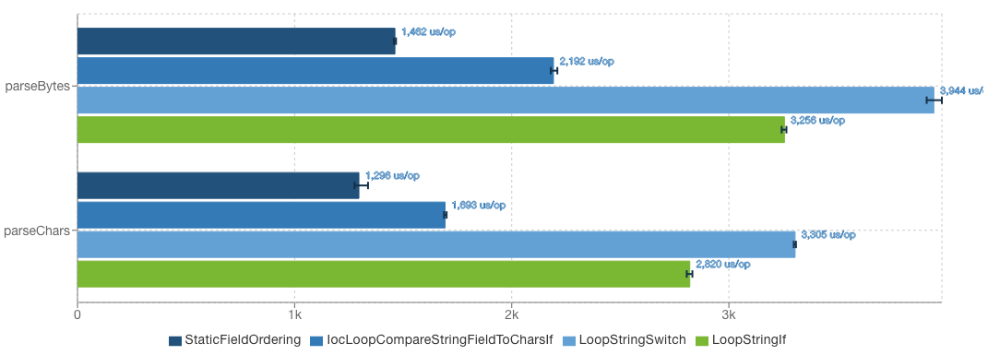
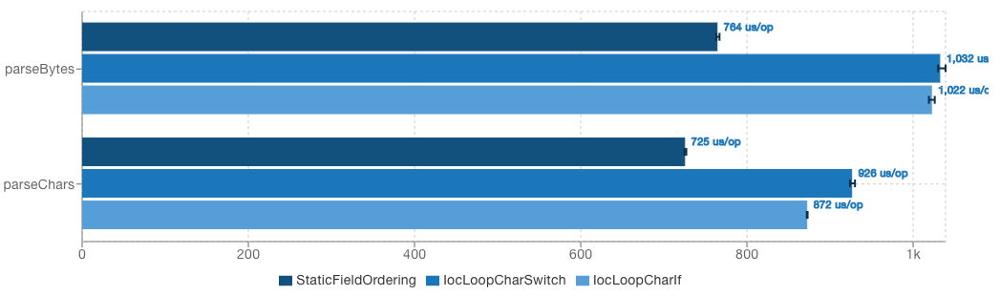

# JSON Iterator [](https://github.com/comodal/json-iterator/actions)

JSON Iterator is a minimal adaption of the [stream parsing features](http://jsoniter.com/java-features.html#iterator-to-rescue) from the project [json-iterator/java](https://github.com/json-iterator/java).

Functionality has been extended with inversion-of-control mechanics to help minimize object creation.

Parsing supports String, byte[], char[] and InputStream data sources.

## Basic Usage

See [JsonIterator.java](systems.comodal.json_iterator/src/main/java/systems/comodal/jsoniter/JsonIterator.java) for the public interface.

```java
var jsonIterator = JsonIterator.parse("{\"hello\": \"world\"}");
System.out.println(jsonIterator.readObjField() + ' ' + jsonIterator.readString());
```

## Recommended Usage

If the presence and ordering of the JSON object fields are guaranteed to always be the same, follow the [`StaticFieldOrdering`](systems.comodal.json_iterator/src/jmh/java/systems/comodal/jsoniter/jmh/styles/StaticFieldOrdering.java#L19) style and simply skip over object field entries.

Otherwise, follow the [`IocLoopCompareStringFieldToCharsIf`](systems.comodal.json_iterator/src/jmh/java/systems/comodal/jsoniter/jmh/styles/IocLoopCompareStringFieldToCharsIf.java#L22) style, which enables inversion of control while it iterates over object fields in conjunction with comparing expected field strings against a field character array.  The advantage of this strategy is that it avoids constructing Strings for object fields.

If the first character for all of an objects' fields are unique, follow either the [`IocLoopCharIf`](systems.comodal.json_iterator/src/jmh/java/systems/comodal/jsoniter/jmh/styles/IocLoopCharIf.java#L20) or [`IocLoopCharSwitch`](systems.comodal.json_iterator/src/jmh/java/systems/comodal/jsoniter/jmh/styles/IocLoopCharSwitch.java#L20) style.  Similar to the style `IocLoopCompareStringFieldToCharsIf`, these styles avoid constructing Strings for object fields.

## Style Comparison Benchmarks

### String Fields

```sh 
> ./gradlew jmh -Pbench=BenchStringFieldStyles
```

Each iteration parses a large json object ([exchangeInfo.json](systems.comodal.json_iterator/src/jmh/resources/exchangeInfo.json)).  The results can also be viewed on [JMH Visualizer](http://jmh.morethan.io/?source=https://raw.githubusercontent.com/comodal/json-iterator/master/benchmark-results/BenchStringFieldStyles/results.json).



### Char Fields

```sh 
> ./gradlew jmh -Pbench=BenchCharFieldStyles
```

Each iteration parses a large json object ([compactFieldsExchangeInfo.json](systems.comodal.json_iterator/src/jmh/resources/compactFieldsExchangeInfo.json)).  The results can also be viewed on [JMH Visualizer](http://jmh.morethan.io/?source=https://raw.githubusercontent.com/comodal/json-iterator/master/benchmark-results/BenchCharFieldStyles/results.json).


