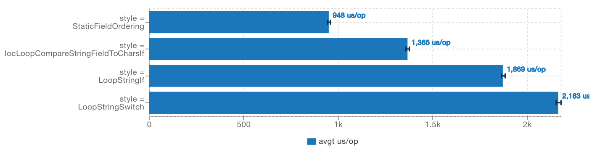
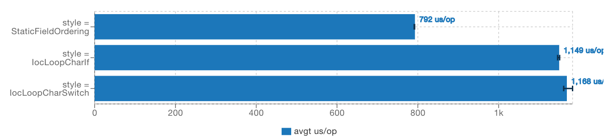

# JSON Iterator [](https://travis-ci.org/comodal/json-iterator) [  ](https://bintray.com/comodal/libraries/json-iterator/_latestVersion)

JSON Iterator is a minimal Java 12 adaption of the original [jsoniter JsonIterator](https://github.com/json-iterator/java), maintaining only the [stream parsing features](http://jsoniter.com/java-features.html#iterator-to-rescue).  See [JsonIterator.java](systems.comodal.json_iterator/src/main/java/systems/comodal/jsoniter/JsonIterator.java) for the public interface.

### Basic Usage
```java
var jsonIterator = JsonIterator.parse("{\"hello\": \"world\"}");
System.out.println(jsonIterator.readObjField() + ' ' + jsonIterator.readString());
```

### Recommended Usage

If the presence and ordering of the JSON object fields are gauranteed to always be the same, follow the [`StaticFieldOrdering`](systems.comodal.json_iterator/src/jmh/java/systems/comodal/jsoniter/jmh/styles/StaticFieldOrdering.java) style and simply skip over object field entries.

Otherwise, follow the [`IocLoopCompareStringFieldToCharsIf`](systems.comodal.json_iterator/src/jmh/java/systems/comodal/jsoniter/jmh/styles/IocLoopCompareStringFieldToCharsIf.java) style, which uses inversion of control to iterate over  object fields in conjunction with comparing expected field strings against a field char-buffer array.  The advantage of this strategy is that it avoids constructing Strings for object fields.

##### Style Comparison Parsing [exchangeInfo.json](systems.comodal.json_iterator/build/resources/jmh/exchangeInfo.json)


If the first character for all of an objects' fields are unique, follow either the [`IocLoopCharIf`](systems.comodal.json_iterator/src/jmh/java/systems/comodal/jsoniter/jmh/styles/IocLoopCharIf.java) or [`IocLoopCharSwitch`](systems.comodal.json_iterator/src/jmh/java/systems/comodal/jsoniter/jmh/styles/IocLoopCharSwitch.java) style.  Similar to the style `IocLoopCompareStringFieldToCharsIf`, these styles avoid constructing Strings for object fields.  Between the two, it is arguably easier to read a switch statement than a sequential chain of if/else-if statements.

##### Style Comparison Parsing [compactFieldsExchangeInfo.json](systems.comodal.json_iterator/build/resources/jmh/compactFieldsExchangeInfo.json)

